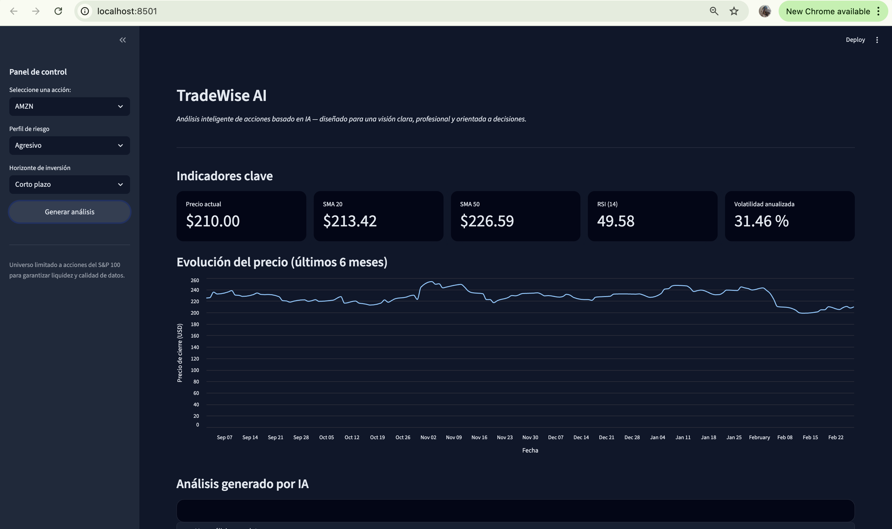
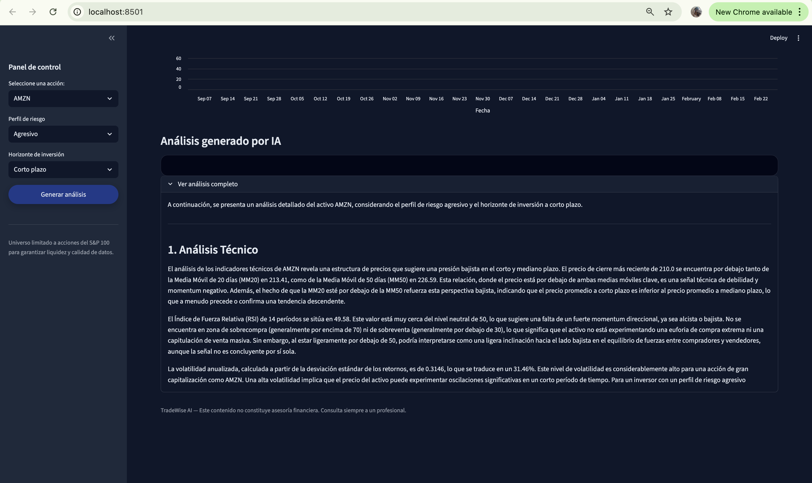

# TradeWise MVP

MVP funcional de una aplicación web para **análisis de trading** utilizando **Streamlit** y la API de **Google Generative AI (Gemini)**. Permite introducir un ticker, perfil de riesgo y horizonte, y obtener un análisis que combina indicadores técnicos, titulares recientes y escenarios alcista/bajista.

**Importante:** Este proyecto es solo educativo. El análisis generado **no es asesoría financiera**. Consulta siempre a un profesional antes de tomar decisiones de inversión.

---

## Requisitos

- **Python 3.10 o superior**
- Cuenta en [Google AI Studio](https://aistudio.google.com/) para obtener una API key de Gemini

---

## Instalación en Mac

### 1. Clonar o copiar el proyecto

Asegúrate de tener la carpeta `tradewise_mvp` en tu Mac (por ejemplo en `~/tradewise_mvp`).

### 2. Crear entorno virtual

Abre **Terminal** y navega a la carpeta del proyecto:

```bash
cd ~/tradewise_mvp
```

Crea un entorno virtual llamado `venv`:

```bash
python3 -m venv venv
```

Activa el entorno virtual:

```bash
source venv/bin/activate
```

Verás `(venv)` al inicio de la línea de comando cuando esté activo.

### 3. Instalar dependencias

Con el entorno virtual activado:

```bash
pip install -r requirements.txt
```

### 4. Configurar la API key de Gemini

Copia el archivo de ejemplo de variables de entorno:

```bash
cp .env.example .env
```

Abre el archivo `.env` con el editor que prefieras:

```bash
nano .env
```

o en VS Code / Cursor:

```bash
code .env
```

Sustituye `your_gemini_api_key_here` por tu API key real:

- Obtén tu clave en: [Google AI Studio - API Keys](https://aistudio.google.com/app/apikey)
- La línea debe quedar así (sin comillas):  
  `GEMINI_API_KEY=tu_clave_real_aqui`

Guarda el archivo. **No subas el archivo `.env` a ningún repositorio** (ya está en `.gitignore` si lo usas).

---

## Ejecución

Con el entorno virtual activado y el `.env` configurado:

```bash
streamlit run app.py
```

Se abrirá el navegador en `http://localhost:8501`. Si no se abre, visita esa URL manualmente.

---

## Ejemplo de uso

1. En el desplegable **Seleccione una acción** elige el ticker del activo (ej: `AAPL`, `MSFT`, `GOOGL`).
2. Elige **Perfil de riesgo**: Conservador, Moderado o Agresivo.
3. Elige **Horizonte**: Corto, Mediano o Largo plazo.
4. Pulsa **Generar análisis**.
5. La app obtendrá datos históricos (6 meses), calculará indicadores (medias móviles, RSI, volatilidad), intentará obtener titulares y enviará todo a Gemini para generar el análisis.
6. El resultado se muestra en secciones: análisis técnico, sentimiento de noticias, escenario alcista, escenario bajista, evaluación de riesgo y advertencia.

---

## Estructura del proyecto

```
tradewise_mvp/
├── app.py           # Interfaz Streamlit y orquestación
├── llm_client.py    # Cliente del LLM (Gemini); fácil de cambiar de proveedor
├── tickers.py       # Lista estática de los 100 tickers permitidos
├── data_fetcher.py  # Obtención de datos (yfinance)
├── indicators.py    # Cálculo de indicadores técnicos
├── requirements.txt
├── .env.example     # Plantilla para .env (copiar a .env)
└── README.md
```

---

## Dónde colocar la API key

- **Solo en el archivo `.env`** en la raíz del proyecto.
- Variable: `GEMINI_API_KEY=tu_clave`
- No incluyas la API key en el código ni la subas a GitHub.

---

## Solución de problemas

- **"GEMINI_API_KEY no configurada"**: Crea `.env` a partir de `.env.example` y añade tu clave.
- **"Ticker no válido"**: Comprueba que el símbolo sea correcto (ej: AAPL para Apple) y que haya datos en Yahoo Finance.
- **Error de API / quota**: Verifica la clave en AI Studio y los límites de uso de la API.

---

## Limitación a las 100 acciones principales

El sistema está **intencionalmente limitado** a analizar únicamente las **100 acciones más importantes (large cap) del mercado estadounidense**, definidas en la lista `TOP_100_TICKERS` del archivo `tickers.py`.

Esta restricción existe por:

- **Control de calidad**: Centrarse en activos con alta liquidez y mejor cobertura de datos.
- **Enfoque estratégico**: Mantener el MVP acotado a un universo de activos relevante y representativo.
- **Reducción de riesgo de datos erróneos**: Menos probabilidad de símbolos exóticos, sin liquidez o con datos incompletos.

Si necesitas ampliar el universo de activos permitido, deberás **modificar manualmente** la lista `TOP_100_TICKERS` en `tickers.py` (añadiendo o sustituyendo tickers) y volver a ejecutar la aplicación.

---

## Licencia y disclaimer

Proyecto de ejemplo. El análisis generado **no constituye asesoría financiera**. El usuario es responsable de sus decisiones de inversión.

---

## Project Preview

<p align="center">
  
</p>

<p align="center">
  
</p>

### Video Demo

https://youtu.be/uzMhC7S7dcA

<p align="center">
  <!-- Replace VIDEO_ID_HERE with the actual YouTube video ID -->
  <a href="https://youtu.be/uzMhC7S7dcA" target="_blank">
    
  </a>
</p>

Este enlace debe apuntar a un video corto demostrando cómo funciona el proyecto de principio a fin.
